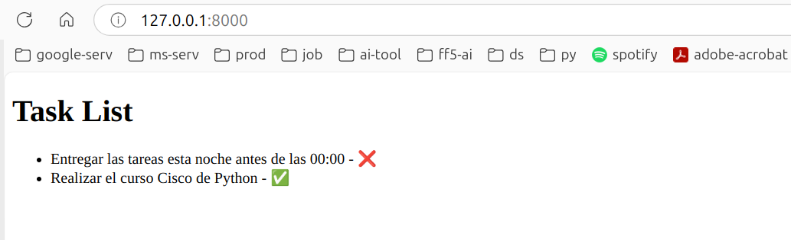
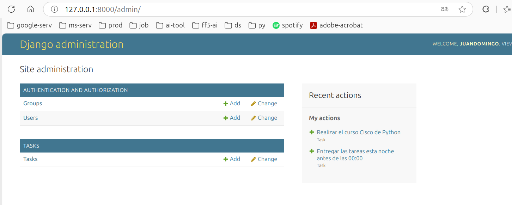

# 🚀 Píldora Django y Proyecto Task Manager

¡Bienvenido al repositorio del proyecto **Task Manager**! Este proyecto es una aplicación web desarrollada con Django que permite gestionar tareas,
marcarlas como completadas y visualizarlas en una interfaz sencilla. A continuación, te explico todo lo que encontrarás en este repositorio.

---

## 📂 Estructura del Repositorio

- **`taskmanager/`**: Proyecto Django con la configuración base.
- **`tasks/`**: Aplicación Django que gestiona las tareas.
- **`docs/`**: Documentos relacionados con el proyecto.
  - 📄 [Presentación en PDF](docs/ai-django-pill-slides.pdf)
  - 📄 [Notas Complementarias en PDF](docs/ai-django-pill-notes.pdf)
- **`README.md`**: Este archivo, que describe el proyecto.

---

## 🛠️ Funcionalidades del Proyecto

El proyecto **Task Manager** incluye las siguientes funcionalidades:

- **Añadir tareas**: Permite crear nuevas tareas con un título y un estado (completado o no).
- **Marcar tareas como completadas**: Cambia el estado de las tareas.
- **Visualizar tareas**: Muestra una lista de todas las tareas en una página HTML.
- **Panel de administración**: Acceso a un panel de administración para gestionar las tareas (crear, editar, eliminar).

---

## 🖥️ Cómo Ejecutar el Proyecto

# 🚀 Pasos para Clonar y Ejecutar el Proyecto Task Manager en Local

A continuación, se detallan los pasos para clonar el repositorio y hacer funcionar el proyecto **Task Manager** en tu máquina local. Se incluyen comandos para **Linux** y **Windows**, usando tanto **pip** como **uv**.

---

## 📥 Paso 1: Clonar el Repositorio

1. **Abre una terminal (Linux) o PowerShell/CMD (Windows)**.

2. **Clona el repositorio**:
   ```bash
   git clone https://github.com/jdomdev/ai-django-pill.git
   ```

3. **Entra en la carpeta del proyecto**:
   ```bash
   cd ai-django-pill
   ```

---

## 🐍 Paso 2: Crear y Activar el Entorno Virtual

### Opción 1: Usando `uv` (Linux y Windows)
1. **Instalar `uv` (si no lo tienes)**:
   ```bash
   pip install uv
   ```

2. **Crear el entorno virtual**:
   ```bash
   uv venv --python python3.13 .venv
   ```

3. **Activar el entorno virtual**:
   - **En Linux**:
     ```bash
     source .venv/bin/activate
     ```
   - **En Windows**:
     ```bash
     .venv\Scripts\activate
     ```

4. **Inicializar el proyecto sin dependencias**:
   ```bash
   uv init --bare
   ```

### Opción 2: Usando `venv` (Linux y Windows)
1. **Crear el entorno virtual**:
   - **En Linux**:
     ```bash
     python3 -m venv .venv
     ```
   - **En Windows**:
     ```bash
     python -m venv .venv
     ```

2. **Activar el entorno virtual**:
   - **En Linux**:
     ```bash
     source .venv/bin/activate
     ```
   - **En Windows**:
     ```bash
     .venv\Scripts\activate
     ```

---

## 📦 Paso 3: Instalar Dependencias

### Opción 1: Usando `uv`
1. **Instalar Django**:
   ```bash
   uv add django
   ```

### Opción 2: Usando `pip`
1. **Instalar Django**:
   ```bash
   pip install django
   ```

---

## 🛠️ Paso 4: Aplicar Migraciones

1. **Aplicar las migraciones**:
   ```bash
   python manage.py migrate
   ```

---

## 👤 Paso 5: Crear un Superusuario (Opcional)

1. **Crear un superusuario**:
   ```bash
   python manage.py createsuperuser
   ```

2. **Sigue las instrucciones para ingresar un nombre de usuario, correo electrónico y contraseña**.

---

## 🚀 Paso 6: Ejecutar el Servidor

1. **Iniciar el servidor**:
   ```bash
   python manage.py runserver
   ```

2. **Acceder a la aplicación**:
   - Abre tu navegador y visita [http://127.0.0.1:8000/](http://127.0.0.1:8000/).

---

## 🎉 ¡Proyecto en Funcionamiento!

Ahora tienes el **Task Manager** funcionando en tu máquina local. Puedes añadir tareas, marcarlas como completadas y ver la lista de tareas en la página principal.

---

### Notas Adicionales:
- **Panel de administración**: Si creaste un superusuario, puedes acceder al panel de administración en [http://127.0.0.1:8000/admin/](http://127.0.0.1:8000/admin/).
- **Dependencias adicionales**: Si el proyecto tiene más dependencias, instálalas usando `uv add <paquete>` o `pip install <paquete>`.

---

¡Listo! Sigue estos pasos y tendrás el proyecto funcionando en tu entorno local. 😊


---

## 📸 Capturas de Pantalla

### Lista de Tareas


### Panel de Administración


---

## 📚 Documentación Adicional

En la carpeta `docs/` encontrarás dos archivos PDF que te ayudarán a entender mejor el proyecto:

1. **Presentación en PDF**: Explica los conceptos clave de Django y cómo se aplican en este proyecto.
2. **Notas Complementarias en PDF**: Contiene información detallada sobre la implementación y configuración del proyecto.

---

## 🛠️ Tecnologías Utilizadas

- **Django**: Framework de desarrollo web en Python.
- **SQLite**: Base de datos ligera utilizada para almacenar las tareas.
- **HTML/CSS**: Para la interfaz de usuario.
- **Git**: Control de versiones.

---

## 🌟 Contribuciones

¡Las contribuciones son bienvenidas! Si deseas mejorar este proyecto, sigue estos pasos:

1. Haz un fork del repositorio.
2. Crea una rama con tu nueva funcionalidad (`git checkout -b feature/nueva-funcionalidad`).
3. Realiza tus cambios y haz commit (`git commit -m 'Añade nueva funcionalidad'`).
4. Haz push a la rama (`git push origin feature/nueva-funcionalidad`).
5. Abre un Pull Request.

---

## 📄 Licencia

Este proyecto está bajo la licencia **MIT**. Para más detalles, consulta el archivo [LICENSE](LICENSE).

---

## 🙏 Agradecimientos

- **Django**: Por proporcionar un framework tan potente y fácil de usar.
- **Factoria F5**: Por la formación y el apoyo en el desarrollo de este proyecto.

---

¡Gracias por visitar este repositorio! Si tienes alguna pregunta o sugerencia, no dudes en abrir un issue o contactarme.

```
